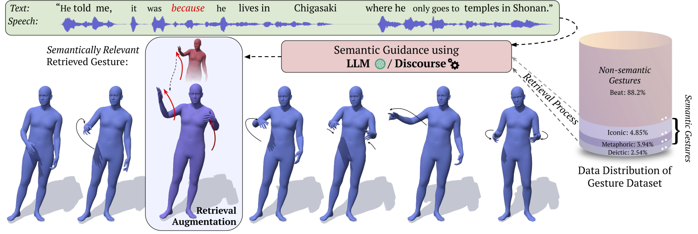

# RAG GESTURE BEATX

Official Implementation for CVPR 2025 "Retrieving Semantics from the Deep: an RAG Solution for Gesture Synthesis"
<br>
RAG-Gesture BEATX is a framework for generating semantic-aware gestures using retrieval-augmented diffusion models.
<br>
The repository is still **Work in progress**



### Citation
```
@InProceedings{mughal2024raggesture,
	title = {Retrieving Semantics from the Deep: an RAG Solution for Gesture Synthesis},
	author = {M. Hamza Mughal and Rishabh Dabral and Merel C. J. Scholman and Vera Demberg and Christian Theobalt},
	booktitle={Computer Vision and Pattern Recognition (CVPR)},
	year={2025}
}
```

## Installation
```
conda create --name "raggesture" python=3.9
conda activate raggesture
pip install -r requirements.txt
```
### Downloading Weights
Download weights from [here](https://nextcloud.mpi-klsb.mpg.de/index.php/s/qQzdP6JY2ASyNWf) and place in `./experiments` directory

## Training the base model:
```
PYTHONPATH=".":$PYTHONPATH python tools/train.py configs/raggesture_beatx/basegesture_len150_beat.py --work-dir ./experiment/basemodel_beatx_len150fps15/ --no-validate
```

## RAG Guided Inference:

### Latent Initialization + Retrieval Guidance

### 1. LLM-driven Gesture Type
For this you would need to export your OpenAI API key as an environment variable named `OPENAI_API_KEY`. 
```
PYTHONPATH=".":$PYTHONPATH python tools/visualize.py \
experiments/base_beatx_len150fps15_finalweights/basegesture_len150_beat.py \
experiments/base_beatx_len150fps15_finalweights/epoch_64.pth \
--retrieval_method llm_guidance_test \
--use_retrieval \
--use_inversion --use_insertion_guidance --guidance_iters decreasing_till_25
```

#### 2. Discourse base Guidance
```
PYTHONPATH=".":$PYTHONPATH python tools/visualize.py \
experiments/base_beatx_len150fps15_finalweights/basegesture_len150_beat.py \
experiments/base_beatx_len150fps15_finalweights/epoch_64.pth \
--retrieval_method discourse_guidance_test \
--use_retrieval \
--use_inversion --use_insertion_guidance --guidance_iters decreasing_till_25
```

#### Options for guidance configurations:
- **decreasing**: less guidance as you go from noisy to clean
- **increasing**: more guidance as you go from noisy to clean
- **drop_decreasing_till_25**: last 25 iterations unguided and decrease the guidance from noisy to clean
- **step_increasing_from_25**: first 10 iterations unguided and increase the guidance from noisy to clean
- **decreasing_till_25**: last 25 iterations unguided and decrease the guidance from noisy to clean
- **increasing_from_25**: first 10 iterations unguided and increase the guidance from noisy to clean

## Evaluation

```
PYTHONPATH=".":$PYTHONPATH python tools/evaluate.py \
results/base_beatx_len150fps15_finalweights_discourse_guidance_test
```

## Long form synthesis
```
PYTHONPATH=".":$PYTHONPATH python tools/longform_synthesis.py \
experiments/base_beatx_len150fps15_finalweights/basegesture_len150_beat.py \ 
experiments/base_beatx_len150fps15_finalweights/epoch_64.pth \
--retrieval_method llm_guidance_testlong 
--use_retrieval 
--use_inversion --use_insertion_guidance --guidance_iters decreasing_till_25 
--test_batchsize 1
```

# RAG Ablations
### Only Latent Initialization (Ablation)
```
PYTHONPATH=".":$PYTHONPATH python tools/visualize.py \
experiments/base_beatx_len150fps15_finalweights/basegesture_len150_beat.py \
experiments/base_beatx_len150fps15_finalweights/epoch_64.pth \
--retrieval_method llm_guidance_test \
--use_retrieval \
--use_inversion
```

### Using Diffusion Inpainting (Ablation)
```
PYTHONPATH=".":$PYTHONPATH python tools/visualize.py \
experiments/base_beatx_len150fps15_finalweights/basegesture_len150_beat.py \
experiments/base_beatx_len150fps15_finalweights/epoch_64.pth \
--retrieval_method llm_guidance_test \
--use_retrieval \
--outpaint
```


# Acknowledgements
This repository is based on [EMAGE](https://pantomatrix.github.io/EMAGE/) and [ReMoDiffuse](https://github.com/mingyuan-zhang/ReMoDiffuse)
and many others
