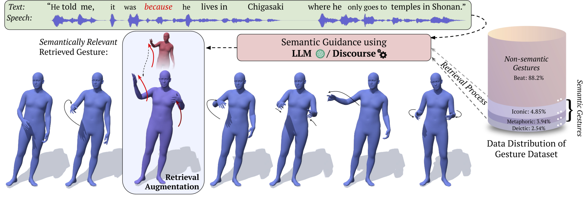

# RAG-GESTURE
Implementation for Retrieving Semantics from the Deep: an RAG Solution for Gesture Synthesis (CVPR 2025)

[](https://vcai.mpi-inf.mpg.de/projects/RAG-Gesture/)



RAG-Gesture BEATX is a framework for generating semantic-aware gestures using retrieval-augmented diffusion models.

## Installation
```
conda create --name "raggesture" python=3.9
conda activate raggesture
```
Install pytorch according to your CUDA and pip/conda configuration. This repository was tested with with `torch==2.8.0`. This can be simple as following commands
```
pip install torch torchvision torchaudio
pip install -r requirements.txt
```

### Downloading the Dataset
The full BEAT2 English release plus our additional annotations (discourse
relations, prosodic prominence, whisper transcriptions, 25 fps SMPL-X, ...)
are bundled in a single Hugging Face dataset repo. Fetch everything into
`datasets/beat_english_v2.0.0/` with:
```
python tools/download_annotations.py
```
This pulls [`m-hamza-mughal/beat2-additional-annotations`](https://huggingface.co/datasets/m-hamza-mughal/beat2-additional-annotations).
Pass `--target <path>` to download to a different location. See
[`datasets/DATASETS.md`](datasets/DATASETS.md) for the expected layout.

### Downloading Weights
Pretrained weights (4 body-part VAEs + the diffusion checkpoint) are hosted
on Hugging Face at
[`m-hamza-mughal/rag-gesture-weights`](https://huggingface.co/m-hamza-mughal/rag-gesture-weights).
Fetch them into `./experiments` with:
```
python tools/download_weights.py
```
Pass `--target <path>` to download to a different location.


## Training the base model:
```
PYTHONPATH=".":$PYTHONPATH python tools/train.py configs/raggesture_beatx/basegesture_len150_beat.py --work-dir ./experiments/new_basemodel_beatx_len150fps15/ --no-validate
```

## RAG Guided Inference:

### Latent Initialization + Retrieval Guidance

### 1. LLM-driven Gesture Type
For this you would need to export your OpenAI API key as an environment variable named `OPENAI_API_KEY`. 
```
PYTHONPATH=".":$PYTHONPATH python tools/visualize.py \
experiments/base_beatx_len150fps15_finalweights/basegesture_len150_beat.py \
experiments/base_beatx_len150fps15_finalweights/epoch_64.pth \
--retrieval_method llm_guidance_test \
--use_retrieval \
--use_inversion --use_insertion_guidance --guidance_iters decreasing_till_25
```

#### 2. Discourse base Guidance
```
 PYTHONPATH=".":$PYTHONPATH python tools/visualize.py \
 experiments/diffusion/base_beatx_len150fps15_finalweights/basegesture_len150_beat.py \
 experiments/diffusion/base_beatx_len150fps15_finalweights/epoch_64.pth \
 --retrieval_method discourse_guidance_test \
 --use_retrieval \
 --use_inversion --use_insertion_guidance --guidance_iters decreasing_till_25 \
 --test_batchsize 1
```

#### Options for guidance configurations:
- **decreasing**: less guidance as you go from noisy to clean
- **increasing**: more guidance as you go from noisy to clean
- **drop_decreasing_till_25**: last 25 iterations unguided and decrease the guidance from noisy to clean
- **step_increasing_from_25**: first 10 iterations unguided and increase the guidance from noisy to clean
- **decreasing_till_25**: last 25 iterations unguided and decrease the guidance from noisy to clean
- **increasing_from_25**: first 10 iterations unguided and increase the guidance from noisy to clean

## Evaluation

```
PYTHONPATH=".":$PYTHONPATH python tools/evaluate.py \
results/base_beatx_len150fps15_finalweights_discourse_guidance_test
```

## Long form synthesis
```
PYTHONPATH=".":$PYTHONPATH python tools/longform_synthesis.py \
experiments/base_beatx_len150fps15_finalweights/basegesture_len150_beat.py \ 
experiments/base_beatx_len150fps15_finalweights/epoch_64.pth \
--retrieval_method llm_guidance_testlong 
--use_retrieval 
--use_inversion --use_insertion_guidance --guidance_iters decreasing_till_25 
--test_batchsize 1
```

# RAG Ablations
### Only Latent Initialization (Ablation)
```
PYTHONPATH=".":$PYTHONPATH python tools/visualize.py \
experiments/base_beatx_len150fps15_finalweights/basegesture_len150_beat.py \
experiments/base_beatx_len150fps15_finalweights/epoch_64.pth \
--retrieval_method llm_guidance_test \
--use_retrieval \
--use_inversion
```

### Using Diffusion Inpainting (Ablation)
```
PYTHONPATH=".":$PYTHONPATH python tools/visualize.py \
experiments/base_beatx_len150fps15_finalweights/basegesture_len150_beat.py \
experiments/base_beatx_len150fps15_finalweights/epoch_64.pth \
--retrieval_method llm_guidance_test \
--use_retrieval \
--outpaint
```


# Acknowledgements
This repository is based on [EMAGE](https://pantomatrix.github.io/EMAGE/) and [ReMoDiffuse](https://github.com/mingyuan-zhang/ReMoDiffuse)
and many others
